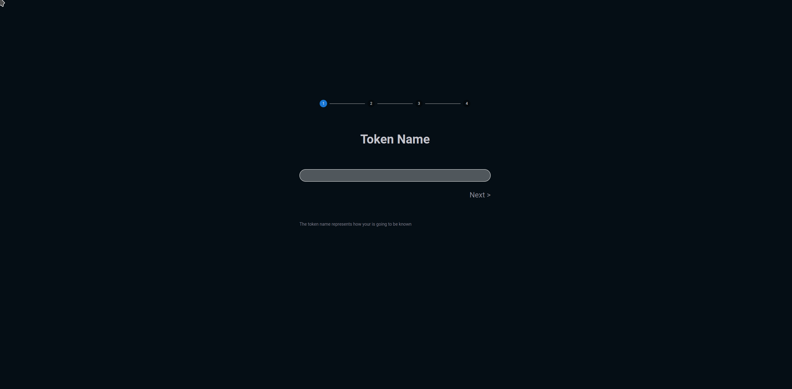
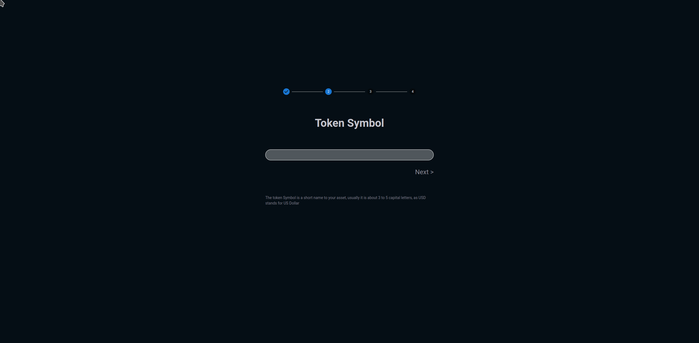
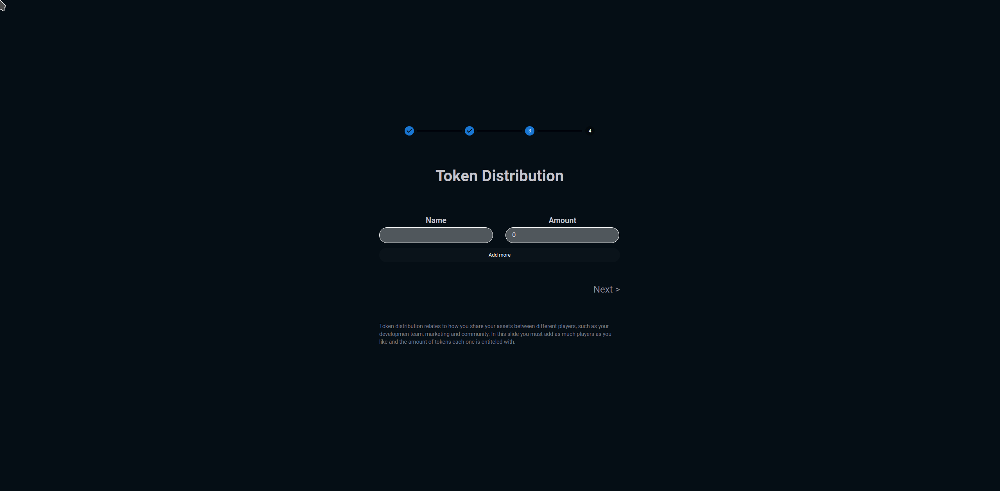
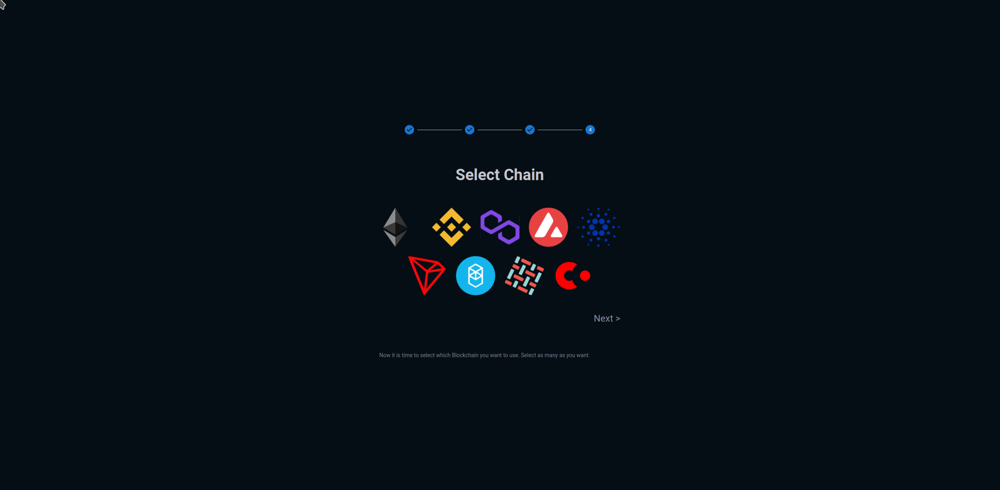

# challenge-viveel

## How to run this project

In the project directory, you can run:

### `Yarn`

yarn && yarn start

### `Npm`

npm install && npm start

## Technologies used

- ReactJS

## Libraries used

- MaterialUI
- Styled components
- React-hook-form
- Recharts
- Zod

### Assumptions

## Form Steps

# Token Name

This step is the entry point, and the user can create his token name.

# Token Symbol

In this step, the user can create his token Symbol.

# Token Distribution

In this step, the user can can set how he is going to share his assets between players.

# Select Chain

This step is the final step and the user can select which Blockchain he wants to use.

# Token Resume

This is the resume and the user can see the details that belong to the previous information added to the token

## TODO

[ x ] separate components (FormContainer)
[ x ] create Form global state
[ x ] validate fields
[ x ] tokenDistribution ADD Button.
[ x ] selectChain logic and layout

[ ] layout
[ ] tokenResume
[ ] unit and integration tests(styled-components)
